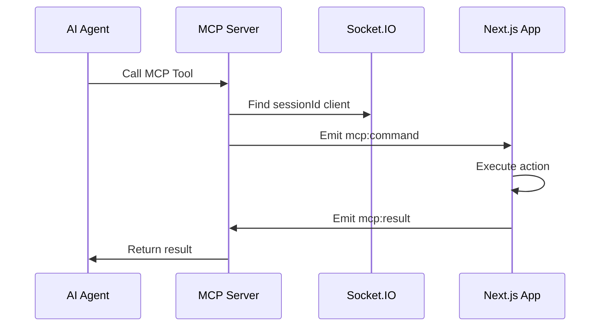

# MCP Server and Next.js Application Connection Report

## Overview

This report details the connection architecture between the Next.js hotel booking application and the MCP (Model Context Protocol) server, along with comprehensive testing instructions using Postman.

## Architecture Overview

The system consists of three main components:
1. **MCP Server** - Provides tools for web automation via Socket.IO
2. **Next.js Application** - Hotel booking frontend with MCP integration
3. **Socket.IO Bridge** - Real-time communication layer

## Connection Flow

### 1. MCP Server Structure

The MCP server (`mcpMain.ts`) implements a dual-mode architecture:

**Modes:**
- **STDIO Mode**: Standard MCP protocol for AI agent communication
- **HTTP Mode**: Socket.IO server for web application integration
- **Both Mode**: Runs both STDIO and HTTP simultaneously

**Server Initialization:**
```typescript
class SimpleMCPServer {
  private server: Server;              // MCP server
  private httpServer?: any;           // HTTP server
  private io?: SocketIOServer;        // Socket.IO server
  private nextjsClients: Map<string, any> = new Map(); // Connected clients
}
```

**Port Configuration:**
- MCP Server HTTP: `localhost:3001`
- Next.js Application: `localhost:3000`
- Socket.IO Namespaces:
  - Main: `http://localhost:3001/`
  - Tools: `http://localhost:3001/tools`

### 2. Socket.IO Namespaces

The MCP server implements two Socket.IO namespaces:

#### Main Namespace (`/`)
- General client connections
- Manual registration via `register:nextjs` event
- Basic connection management

#### Tools Namespace (`/tools`)
- **Primary namespace for Next.js clients**
- Auto-registration of connected clients
- All MCP tool operations routed through this namespace

### 3. Next.js Client Connection

The Next.js application connects to the MCP server via multiple layers:

#### WebSocket Manager (`mcpWebSocketManager.ts`)
```typescript
class MCPWebSocketManager {
  private socket: Socket | null = null;
  private isConnected: boolean = false;
  private connectionError: string | null = null;
  
  async connect(): Promise<MCPResult<boolean>> {
    const baseUrl = process.env.NEXT_PUBLIC_MCP_SOCKET_URL || 'http://localhost:3001';
    const socketUrl = `${baseUrl}/tools`; // Connects to /tools namespace
    
    this.socket = io(socketUrl, {
      transports: ['websocket', 'polling'],
      timeout: 10000,
      reconnection: false
    });
  }
}
```

#### Socket Client (`socketClient.ts`)
```typescript
class SocketClient {
  private connect(): void {
    this.socket = io(`${socketUrl}/tools`, {
      autoConnect: true,
      reconnection: true,
      reconnectionAttempts: 5,
      reconnectionDelay: 1000,
      reconnectionDelayMax: 5000,
      timeout: 20000,
      transports: ['websocket', 'polling']
    });
  }
}
```

## MCP Tools and Event Mapping

### Available MCP Tools

1. **getCurrentPage**
   - Description: Get current page information
   - Event Flow: `mcp:getCurrentPage` → `mcp:pageInfo`

2. **getClickableElements**
   - Description: Get clickable elements on current page
   - Event Flow: `mcp:getClickableElements` → `mcp:clickableElements`

3. **clickElement**
   - Description: Click a named element
   - Event Flow: `mcp:clickElement` → `mcp:clickResult`
   - Parameters: `elementName`

4. **navigatePage**
   - Description: Navigate to a page
   - Event Flow: `mcp:navigatePage` → `mcp:navigationResult`
   - Parameters: `page`

5. **fillBookingForm**
   - Description: Fill booking form with data
   - Event Flow: `mcp:fillBookingForm` → `mcp:bookingFormResult`
   - Parameters: Form data object

### Event Communication Pattern



## Environment Configuration

### MCP Server Environment
```bash
# Default port
PORT=3001

# Startup modes
npm start          # STDIO mode
npm start http     # HTTP mode (Socket.IO)
npm start both     # Both modes
```

### Next.js Environment
```bash
# Required environment variable
NEXT_PUBLIC_MCP_SOCKET_URL=http://localhost:3001

# Optional server-side variable
MCP_SOCKET_URL=http://localhost:3001
```

## Connection Lifecycle

### 1. Server Startup
```bash
cd mcp-server
npm run build
npm start http
```

Console Output:
```
MCP Server running on port 3001
Socket.IO listening on http://localhost:3001
Tools namespace available at http://localhost:3001/tools
```

### 2. Next.js Connection
```bash
cd site
npm run dev
```

Connection Events:
```
🔌 [TOOLS] Client connected to tools namespace: <socket-id>
✅ [TOOLS] Auto-registered Next.js client: <socket-id>
✅ [TOOLS] Updated client list: [<socket-id>]
```

### 3. Tool Execution Flow
```
Agent Request → MCP Server → Socket.IO → Next.js → DOM Manipulation → Response
```

## Testing with Postman

### Prerequisites

1. **Start MCP Server**
   ```bash
   cd mcp-server
   npm run build
   npm start http
   ```

2. **Start Next.js Application**
   ```bash
   cd site
   npm run dev
   ```

3. **Verify Connection**
   - Visit `http://localhost:3000` to establish Socket.IO connection
   - Check console for connection logs

### Postman Test Collection

#### Test 1: Server Health Check

**Request:**
- Method: `GET`
- URL: `http://localhost:3001/`
- Expected: Basic server response

#### Test 2: List Available Tools

**Request:**
- Method: `POST`
- URL: `http://localhost:3001/mcp`
- Headers: `Content-Type: application/json`
- Body:
```json
{
  "jsonrpc": "2.0",
  "id": 1,
  "method": "tools/list",
  "params": {}
}
```

**Expected Response:**
```json
{
  "jsonrpc": "2.0",
  "id": 1,
  "result": {
    "tools": [
      {
        "name": "getCurrentPage",
        "description": "Get current page information",
        "inputSchema": {
          "type": "object",
          "properties": {
            "sessionId": {
              "type": "string",
              "description": "Optional session ID to target specific client"
            }
          },
          "required": []
        }
      }
      // ... other tools
    ]
  }
}
```

#### Test 3: Get Current Page Info

**Request:**
- Method: `POST`
- URL: `http://localhost:3001/mcp`
- Headers: `Content-Type: application/json`
- Body:
```json
{
  "jsonrpc": "2.0",
  "id": 2,
  "method": "tools/call",
  "params": {
    "name": "getCurrentPage",
    "arguments": {}
  }
}
```

**Expected Response:**
```json
{
  "jsonrpc": "2.0",
  "id": 2,
  "result": {
    "content": [
      {
        "type": "text",
        "text": "{\n  \"url\": \"http://localhost:3000\",\n  \"title\": \"Hotel Booking\",\n  \"path\": \"/\"\n}"
      }
    ]
  }
}
```

#### Test 4: Get Clickable Elements

**Request:**
- Method: `POST`
- URL: `http://localhost:3001/mcp`
- Headers: `Content-Type: application/json`
- Body:
```json
{
  "jsonrpc": "2.0",
  "id": 3,
  "method": "tools/call",
  "params": {
    "name": "getClickableElements",
    "arguments": {}
  }
}
```

**Expected Response:**
```json
{
  "jsonrpc": "2.0",
  "id": 3,
  "result": {
    "content": [
      {
        "type": "text",
        "text": "[\n  {\n    \"name\": \"rooms-link\",\n    \"description\": \"Navigate to rooms page\",\n    \"selector\": \"a[href='/rooms']\",\n    \"text\": \"Rooms\"\n  }\n  // ... other elements\n]"
      }
    ]
  }
}
```

#### Test 5: Click Element

**Request:**
- Method: `POST`
- URL: `http://localhost:3001/mcp`
- Headers: `Content-Type: application/json`
- Body:
```json
{
  "jsonrpc": "2.0",
  "id": 4,
  "method": "tools/call",
  "params": {
    "name": "clickElement",
    "arguments": {
      "name": "rooms-link"
    }
  }
}
```

**Expected Response:**
```json
{
  "jsonrpc": "2.0",
  "id": 4,
  "result": {
    "content": [
      {
        "type": "text",
        "text": "{\n  \"success\": true,\n  \"currentPage\": {\n    \"url\": \"http://localhost:3000/rooms\",\n    \"title\": \"Rooms - Hotel Booking\",\n    \"path\": \"/rooms\"\n  }\n}"
      }
    ]
  }
}
```

#### Test 6: Navigate Page

**Request:**
- Method: `POST`
- URL: `http://localhost:3001/mcp`
- Headers: `Content-Type: application/json`
- Body:
```json
{
  "jsonrpc": "2.0",
  "id": 5,
  "method": "tools/call",
  "params": {
    "name": "navigatePage",
    "arguments": {
      "page": "/booking"
    }
  }
}
```

#### Test 7: Fill Booking Form

**Request:**
- Method: `POST`
- URL: `http://localhost:3001/mcp`
- Headers: `Content-Type: application/json`
- Body:
```json
{
  "jsonrpc": "2.0",
  "id": 6,
  "method": "tools/call",
  "params": {
    "name": "fillBookingForm",
    "arguments": {
      "checkIn": "2024-01-15",
      "checkOut": "2024-01-17",
      "guests": 2,
      "name": "John Doe",
      "email": "john.doe@example.com"
    }
  }
}
```

### Socket.IO Direct Testing (Alternative)

For direct Socket.IO testing, you can use a Socket.IO client:

#### Connect to Tools Namespace
```javascript
const io = require('socket.io-client');
const socket = io('http://localhost:3001/tools');

socket.on('connect', () => {
  console.log('Connected to MCP server');
  
  // Register as Next.js client
  socket.emit('register:nextjs');
  
  // Test MCP events
  socket.emit('mcp:getCurrentPage');
});

socket.on('mcp:pageInfo', (data) => {
  console.log('Page info received:', data);
});
```

## Error Handling and Troubleshooting

### Common Connection Issues

1. **No Next.js clients connected**
   - Ensure Next.js app is running on `localhost:3000`
   - Check `NEXT_PUBLIC_MCP_SOCKET_URL` environment variable
   - Verify Socket.IO connection in browser console

2. **Timeout errors**
   - MCP tools have timeouts (5-15 seconds)
   - Ensure Next.js app is responsive
   - Check for JavaScript errors in browser

3. **Socket.IO connection failures**
   - CORS configuration allows all origins
   - Firewall/network restrictions
   - Port conflicts

### Debug Logging

The system provides extensive logging:

**MCP Server Logs:**
```
🔌 [TOOLS] Client connected to tools namespace: <id>
✅ [TOOLS] Auto-registered Next.js client: <id>
📤 [getCurrentPage] Emitting 'mcp:getCurrentPage' to client
📥 [getCurrentPage] Received response from client: {...}
```

**Next.js Browser Logs:**
```
🔌 [MCP Debug] Connected to MCP server, socket ID: <id>
📍 [MCP Debug] Received mcp:getCurrentPage request
✅ [MCP Debug] mcp:pageInfo response sent successfully
```

## Performance Considerations

1. **Connection Pooling**: Single Socket.IO connection per browser session
2. **Rate Limiting**: Built-in rate limiting for connection attempts
3. **Timeouts**: Configurable timeouts for each tool operation
4. **Reconnection**: Automatic reconnection with exponential backoff
5. **Resource Cleanup**: Proper cleanup of event listeners and timers

## Security Considerations

1. **CORS**: Currently allows all origins for development
2. **Environment Variables**: Socket URL configuration
3. **Input Validation**: Form data validation on both client and server
4. **Rate Limiting**: Prevents excessive requests
5. **Error Handling**: Prevents information leakage in error messages

## API Endpoints Summary

| Endpoint | Method | Purpose | Body |
|----------|---------|---------|------|
| `/` | GET | Health check | None |
| `/mcp` | POST | MCP protocol requests | JSON-RPC 2.0 |
| `/tools` (Socket.IO) | WebSocket | Real-time MCP events | Socket.IO events |

## Testing Checklist

- [ ] MCP server starts successfully
- [ ] Next.js app connects to Socket.IO
- [ ] Client registration appears in logs
- [ ] `getCurrentPage` returns valid page data
- [ ] `getClickableElements` returns element array
- [ ] `clickElement` successfully navigates
- [ ] `navigatePage` changes URL
- [ ] `fillBookingForm` populates form fields
- [ ] Error handling works for invalid requests
- [ ] Reconnection works after connection loss

This comprehensive report provides the foundation for understanding and testing the MCP server integration with the Next.js hotel booking application.
